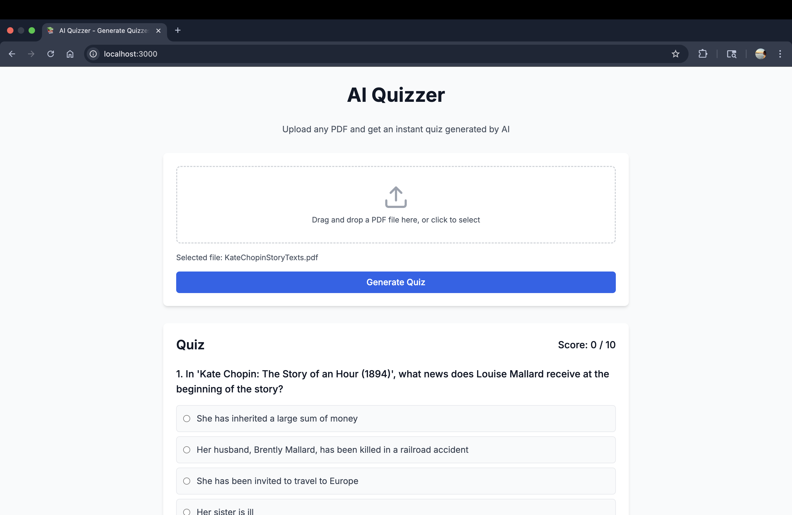
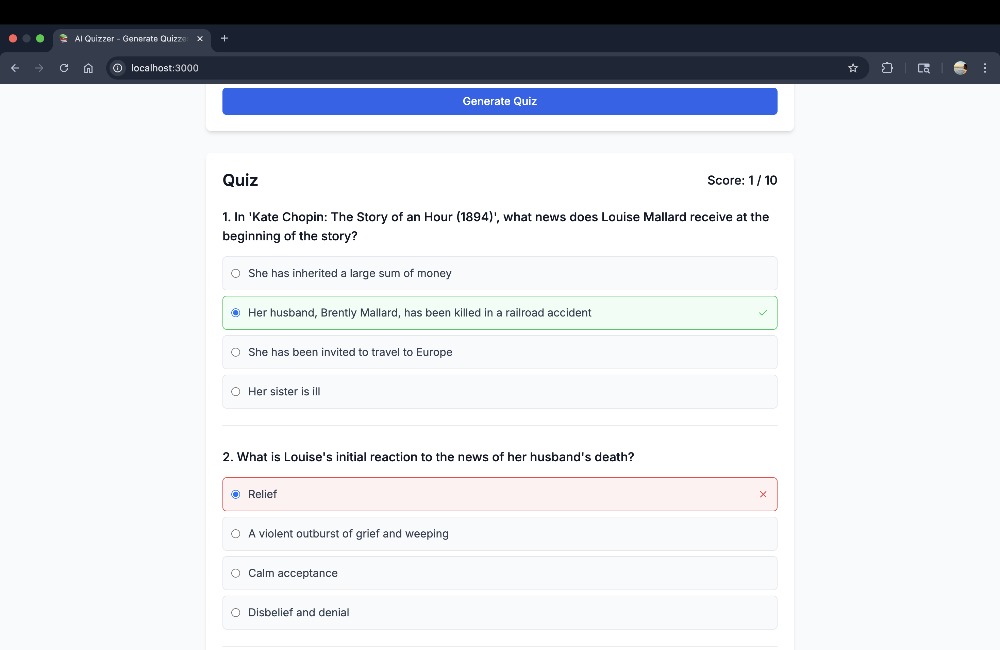

# AI Quizzer

AI Quizzer is a web application that generates multiple-choice quizzes from PDF documents using Google's Gemini AI. The application allows users to upload PDF files and automatically creates engaging quizzes based on the content.

## Features

- PDF file upload and processing
- Automatic quiz generation using Gemini AI
- Multiple-choice questions with randomized answer positions
- Real-time score tracking
- Modern, responsive UI built with Next.js and Tailwind CSS

## Screenshots

### Upload Interface


### Quiz Interface


## Prerequisites

- Node.js 18.0 or later
- npm (Node Package Manager)
- Google Gemini API key (Get it from [Google AI Studio](https://makersuite.google.com/app/apikey))

## Setup

1. Clone the repository:
```bash
git clone https://github.com/jayrajpamnani/AIQuizzer.git
cd aiquizzer
```

2. Install dependencies:
```bash
npm install
```

3. Create a `.env.local` file in the root directory:
```bash
touch .env.local
```

4. Add your Gemini API key to the `.env.local` file:
```env
GEMINI_API_KEY=your_api_key_here
```
Replace `your_api_key_here` with your actual Gemini API key. For example:
```env
GEMINI_API_KEY=AIzaSyA1234567890abcdefghijklmnopqrstuvwxyz
```

5. Start the development server:
```bash
npm run dev
```

6. Open [http://localhost:3000](http://localhost:3000) in your browser.

## Usage

1. Click the "Choose File" button to select a PDF file (max size: 1MB)
2. Click "Generate Quiz" to create a quiz from the PDF content
3. Answer the questions by selecting one of the four options
4. View your score at the end of the quiz

## Technical Details

- Built with Next.js 14 and TypeScript
- Uses Google's Gemini AI for content processing and quiz generation
- Styled with Tailwind CSS
- Implements responsive design for all screen sizes

## File Structure

```
aiquizzer/
├── app/
│   ├── api/
│   │   └── quiz/
│   │       └── route.ts    # API endpoint for quiz generation
│   ├── page.tsx            # Main application page
│   └── layout.tsx          # Root layout component
├── public/                 # Static assets
└── types/                  # TypeScript type definitions
```

## Limitations

- Maximum PDF file size: 1MB
- Only supports PDF file format
- Requires an active internet connection for AI processing

## Contributing

Feel free to submit issues and enhancement requests! 